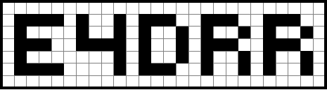
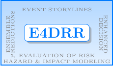
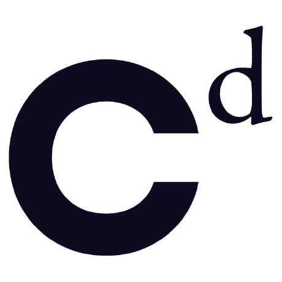
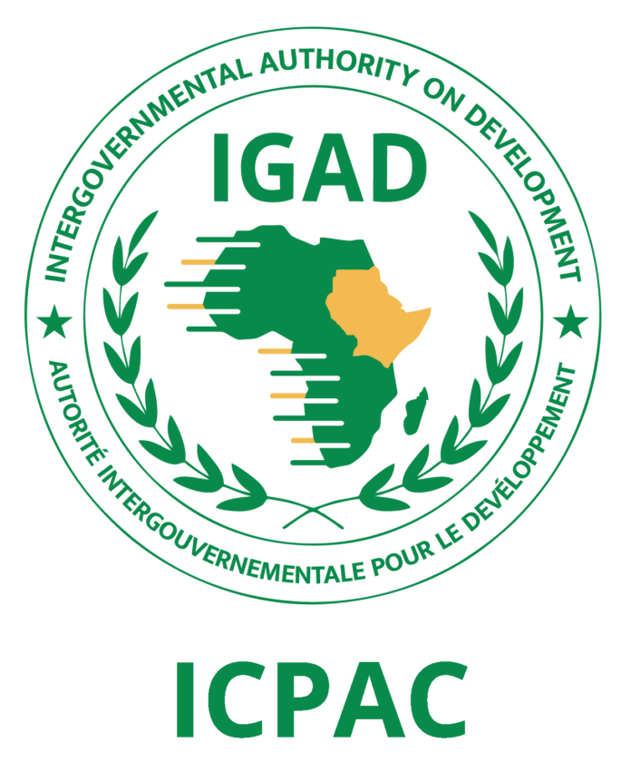
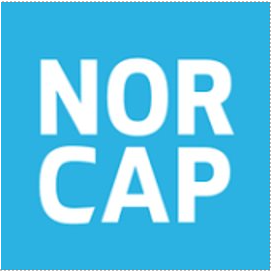

# E4DRR

# Hazard Modeling, Impact Estimation, and Climate Storylines for Drought and Flood Disasters in Eastern Africa

This project aims to enhance the **East Africa Hazard Watch Portal** as a decision-support and actionable information tool for Disaster Risk Management (DRM). It uses impact-based forecasting grounded on a chain of auditable evidence synthesized from event-based climate storylines.

**Project website and updates in blog:** [https://icpac-igad.github.io/e4drr/](https://icpac-igad.github.io/e4drr/)

<!-- First row: smaller logo -->

  

<!-- Second row: larger logos -->

  

---

## Project Funding and Partners

This project is funded by the **United Nations | Complex Risk Analytics Fund (CRAF’d)**.

The Complex Risk Analytics Fund (CRAF’d) is the first and only multi-partner instrument to finance, connect, and reimagine data to save lives.

  

### Project Partners

- **ICPAC**   
- **NORCAP** 

  
  

