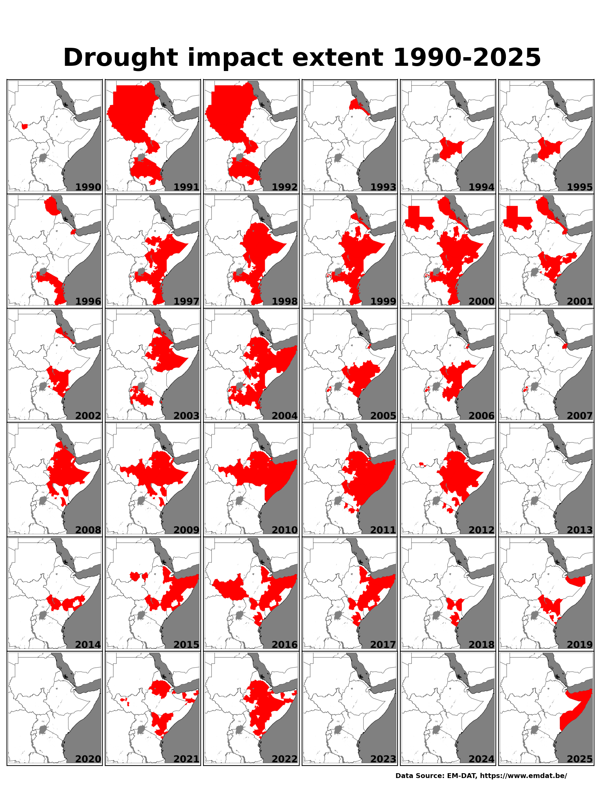
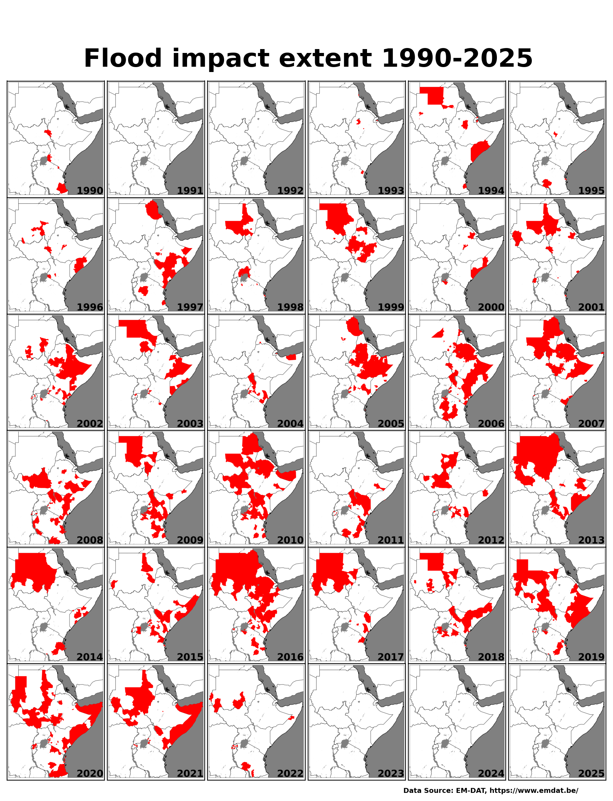
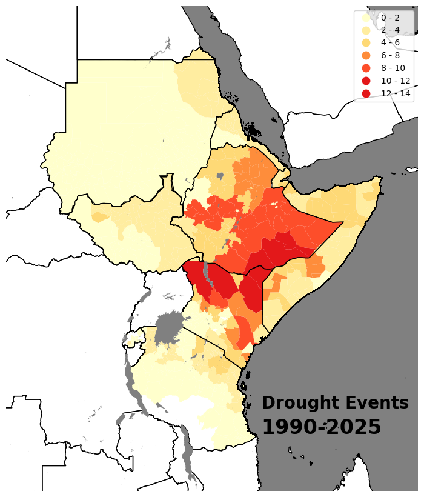
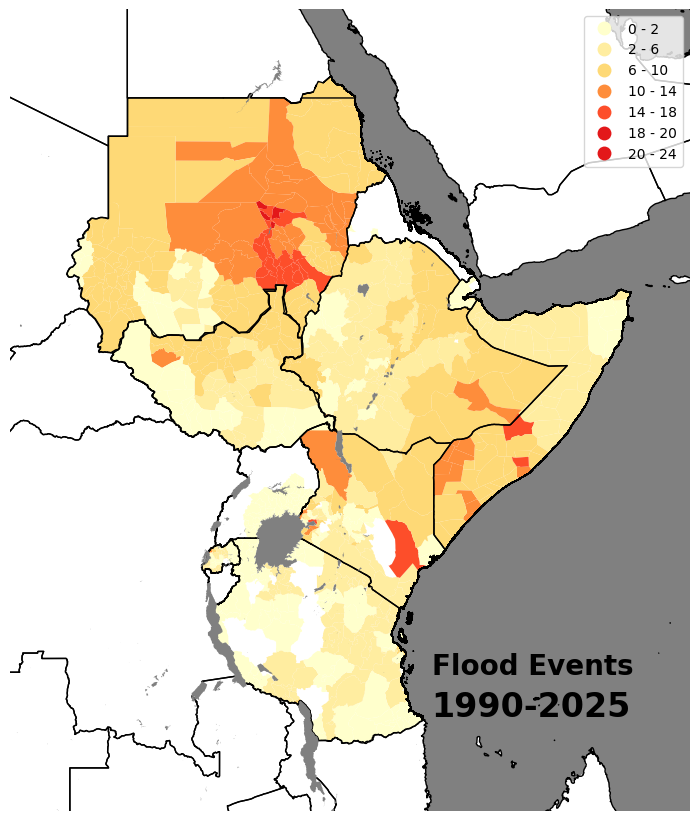

# The EM-DAT database: East Africa Drought and Flood Impact Events Analysis 

The EM-DAT database, managed by the Centre for Research on the Epidemiology of Disasters (CRED), is a comprehensive global repository that tracks the occurrence and impacts of mass disasters from 1900 to the present. It includes over 26,000 records sourced from UN agencies, NGOs, insurance companies, research institutes, and media outlets. Each entry is validated and categorized by disaster type, impact level, and affected regions, facilitating analysis of disaster trends and informing disaster risk reduction strategies.

In the context of East Africa, the EM-DAT database provides valuable insights into the frequency and severity of drought and flood events. By analyzing this data, researchers and policymakers can identify patterns, assess vulnerabilities, and develop targeted interventions to mitigate the impacts of these disasters on communities and ecosystems.

The [ea-impact-events GitHub repository](https://github.com/icpac-igad/ea-impact-events) offers a codebase that processes EM-DAT data to generate visualizations of drought and flood events in East Africa. By integrating administrative boundary information, the repository enables the creation of year-wise and frequency-based maps at the administrative level, providing a detailed understanding of the spatial distribution and recurrence of these events. These visualizations are essential for informed decision-making and effective disaster risk management in the region.

## Year-wise Drought Maps

Map showing the extent of drought events year wise.

---

## Year-wise Flood Maps

Map showing the extent of flood events year wise.

---

## Frequency of Drought events in East Africa, 1990–2025 

Map showing the frequency of drought events over the period 1990–2025.

---

## Frequency of Flood events in East Africa, 1990–2025 

Map showing the frequency of flood events over the period 1990–2025.

---

